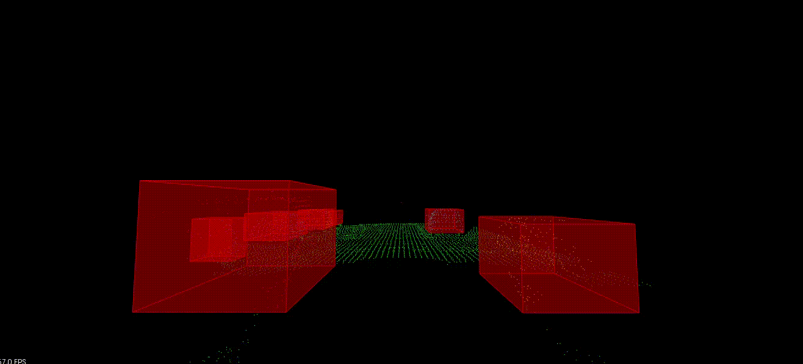

<<<<<<< HEAD
# LiDAR-Radar-and-Camera-Data-Fusion-and-Analysis
LiDAR, Radar and Camera Data Fusion and Analysis
=======
# Udacity Sensor Fusion Nanodegree Program

In this program, I have learned knowledge in two different sensors, Lidar and Radar. Code has been developed to detect obstacles using Lidar point cloud data, to track the object using Camera images, to detect range and velocity of targe based on Radar data, and to fuse Lidar/Radar measurement to predict the object's movement using Kalman Filter.

|  Criteria  |  Lidar  |  Radar  |  Camera  |
|------------|---------|---------|----------|
| **Range**      | Meters to 200m | Meters to 200m | Only stereo camera setup can measure distance up to 80m |
| **Spatial Resolution** | High, 0.1 degree due to short wavelength laser | Cannot resolve small features | Defined by optics, pixel size of image and its signal-to-noise ratio |
| **Robustness in Darkness** | Excellent, due to active | Excellent, due to active | Reduced |
| **Robustness in Rain, Snow, Fog** | Limited, due to optical | Best | Limited, due to optical |
| **Classification of Objects** | Some level of classification by 3D point clouds | Not too much classification | Excellent at classification |
| **Perceiving 2D Structures** | N/A | N/A | The only sensor that is able to interpret traffic signs, lane markings, traffic lights |
| **Measure Speed** | Approximate speed by using successive distance measurement | Measure velocity by exploiting the Doppler frequency shift | Can only measure time to collision by observing the displacement of objects on the image plane |
| **System Cost** | More expensive | Compact and affordable | Compact and affordable |
| **Package Size** | Hard to integrate | Easily integrated | Easily integrated for mono cameras, but stereo camera setup is bulky |
| **Computational Requirements** | Little | Little | Significant |

**Sensor Fusion** by combing Lidar's high resolution imaging with radar's ability to measure velocity of objects we can get a better understanding of the surrounding environment than we could using one of the sensors alone.

### Project 1 - Lidar Obstacle Detection

In this project, I processed multiple point clouds data files from Lidar sensor, and detected the cars or other obstacles on a city street. The detection pipeline was implemented by the **Voxel Grid and ROI based filtering**, **3D RANSAC segmentation**, **Euclidean clustering based on KD-Tree**, and **bounding boxes**.

My final result is shown below, where the green points represent the street surface and the obstacles are marked in the red boxes.

Please check the detailed project description in the [Lidar_Obstacle_Detection/README.md](Lidar_Obstacle_Detection/README.md).

### Project 2 - 3D Object Tracking based on Camera

This project tracks the preceding vehicle in the same lane and estimates the time-to-collision (TTC) based on both camera images and Lidar data. To build up the camera TTC estimation pipeline, I implemented the keypoint detection, descriptor extraction, and methods matched keypoints between successive images. With the help of 3D bounding boxes, I was able to extract keypoints corresponding to the preceding vehicle and calculate the TTC based on relative distance between matched keypoints in two successive images. Matched keypoints also contributed to match 3D bounding boxes in the Lidar point cloud, so that Lidar pipeline could estimate the TTC using the closest distances of the bounding boxes to the ego vehicle in two successive frame.

The output clip is shown below, where the preceding vehicle is tracked with a green box, 3D Lidar points on the vehicle trunk are projected to the 2D frame (green points). TTC estimations based on Lidar and camera are reported on the top.

Please check the detailed project description in the [Camera/Lesson-7-Project-3D-Object-Tracking/README.md](Camera/Lesson-7-Project-3D-Object-Tracking/README.md).

### Project 3 - Velocity and Range Detection based on Radar

This project first defines a target with certain velocity and position, as well as Radar specifications. It then propagates the Radar wave signal based on the Frequency Modulated Continuous Wave (FWCW) model. Range and Doppler 2D FFT is applied to the received signal to determine the range and velocity of the target. At the end, 2D Constant False Alarm Rate (CFAR) detector is performed on the 2D FFT, which detects the target.

The result looks like that Matlab plot below, indicating a target is detected with a range of about 81m and a velocity of about -20m/s.

Please check the detailed project description in the [Radar/project/README.md](Radar/project/README.md).

>>>>>>> (Initial commit)
